# Proyecto Final - Portafolio Modular

## Descripción General

Sitio web modular que integra tres espacios interconectados —**portafolio**, **imprenta** y **laboratorio 3D**— funcionando como portafolio personal y landing page. Los usuarios podrán visualizar proyectos, contactar e idealmente cotizar productos.

### Concepto de Diseño

- **Hub central**: Sitio web principal que funciona como puerta de entrada a tres áreas con funciones diferenciadas pero coherentes visualmente
- **Secciones híbridas**: Combina contenido estático (landing pages y portafolio) con funciones dinámicas (seguimiento de cotización y servicios con inicio de sesión)
- **Flujo de usuario**: Página principal con registro → Hub de landing pages → Áreas específicas de interés

## Objetivos

**Objetivo General**: Unificar la presentación de identidad creativa y servicios de producción en un ecosistema digital modular que facilite la exploración de proyectos y la solicitud de cotizaciones sin salir del mismo entorno.

## Usuarios Objetivo

### Usuario Extremo 1: Martín T. — El curioso escéptico

**Perfil:**
- 40 años, Gerente de Marketing y PyME
- Usuario ocasional de servicios de diseño
- Prefiere contacto directo, sin tiempo para formularios largos

**Comportamiento:**
- Busca rápidamente sin comprometerse
- Desconfía de sitios "muy creativos" que parecen poco profesionales
- Prefiere referencias y casos concretos
- Navega desde celular en horario laboral

**Necesidades:**
- Ver credibilidad rápido (portafolio, clientes previos)
- Precios orientativos sin compromiso
- Respuesta rápida a consultas

**Meta**: Evaluar si el servicio es confiable antes de invertir tiempo

---

### Usuario Extremo 2: Sofía L. — La estudiante autodidacta

**Perfil:**
- 20 años, Estudiante de diseño
- Usuario intensivo de redes sociales e inspiración visual
- Sensible al precio, primera vez usando servicios profesionales

**Comportamiento:**
- Explora TODO el sitio antes de decidir
- Ama el aspecto visual y la estética
- Valora tutoriales y ejemplos
- Comparte en redes lo que le gusta

**Necesidades:**
- Interfaz visual que inspire confianza creativa
- Explicaciones claras (no tecnicismos)
- Ejemplos de costos accesibles

**Meta**: Materializar un proyecto académico sin gastar demasiado

---

### Usuario Promedio: Camila R. — La creativa independiente

**Perfil:**
- 27 años, Diseñadora freelance/ilustradora
- Usa laptop y celular indistintamente
- Activa en comunidades creativas

**Comportamiento:**
- Busca equilibrio entre calidad y precio
- Valora la experiencia visual pero también la funcionalidad
- Quiere entender el proceso sin complicaciones técnicas
- Prefiere plataformas donde pueda volver fácilmente

**Necesidades:**
- Ver portafolio para evaluar estilo
- Cotizar sin compromiso pero con claridad
- Sentir que hay asesoría personalizada
- Guardar favoritos o volver a cotizaciones previas

**Meta**: Profesionalizar su marca personal con materiales impresos y prototipos de calidad

## Análisis de Antecedentes

### 1. [Lowtech](https://www.lowtech.cl)
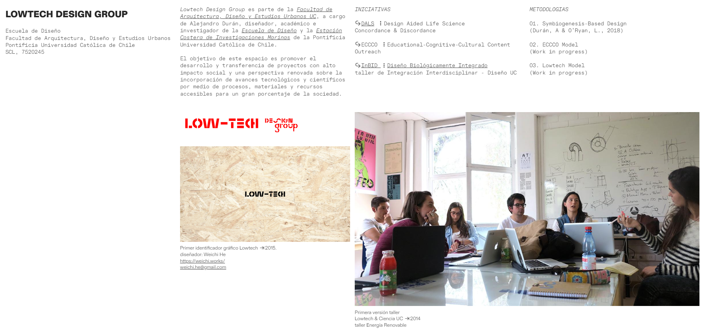

**Tipo:** Estudio de diseño chileno con estética minimalista y contemporánea

 **Aspectos positivos:**
- Navegación intuitiva con foco en contenido visual
- Estética profesional sin sacrificar creatividad
- Carga rápida y experiencia fluida

 **Aspectos negativos:**
- Poca información sobre procesos o servicios específicos
- Sin funcionalidades interactivas (formularios, cotizadores)
- Puede resultar demasiado minimalista y saturante

---

### 2. [Hey Diseño](https://www.heydiseno.cl/somos-hey-agencia-de-diseno)
**Tipo:** Agencia de diseño chilena fundada en 2014

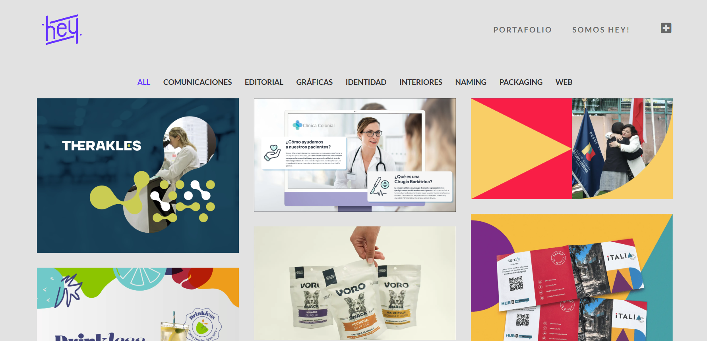

 **Aspectos positivos:**
- Estructura clara que separa servicios (Estrategia, Diseño de marca, Aplicaciones, Digital)
- Muestra casos de estudio y proyectos destacados
- Lenguaje cercano y profesional
- Integra links a Behance para ampliar portafolio
- Balance entre información y visual

  **Aspectos negativos:**
- No tiene cotizador ni sistema de contacto dinámico

---

### 3. [Siente Cinco](https://branding.sientecinco.cl/)
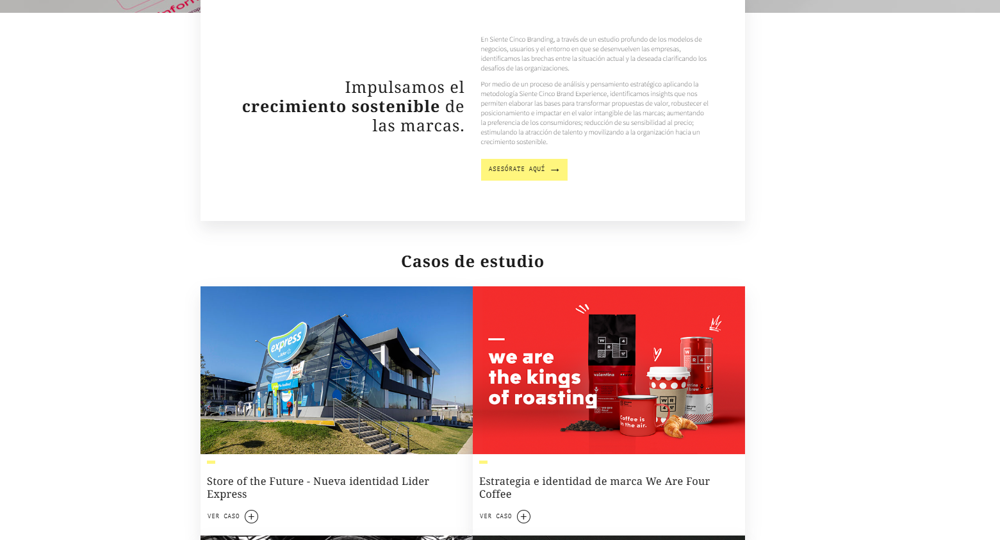
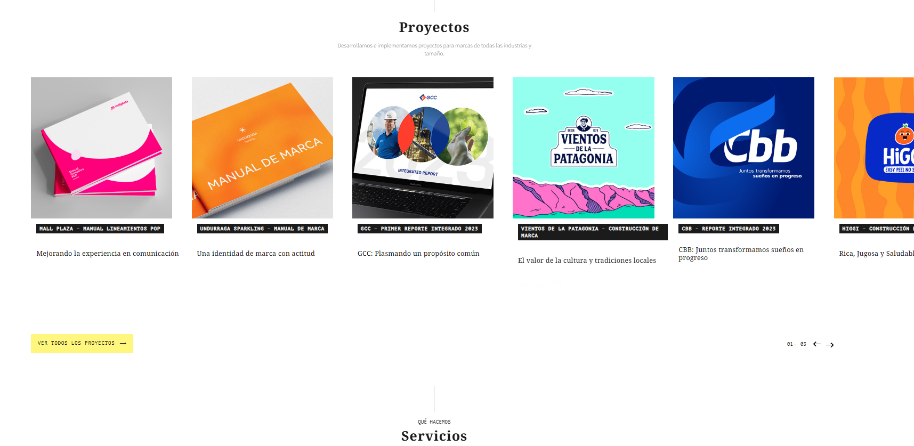
**Tipo:** Consultora de branding estratégico chilena

 **Aspectos positivos:**
- Casos de estudio muy bien documentados con contexto estratégico
- Diseño sobrio y profesional que genera confianza
- Estructura clara: casos → servicios → contacto
- Demuestra impacto real en negocios grandes

  **Aspectos negativos:**
- Demasiado corporativo, puede intimidar a clientes pequeños
- Poco accesible para usuarios casuales o estudiantes
- No muestra procesos creativos ni behind-the-scenes

---

### 4. [Portafolio Personal](https://mikuby11.github.io/Clase_10)
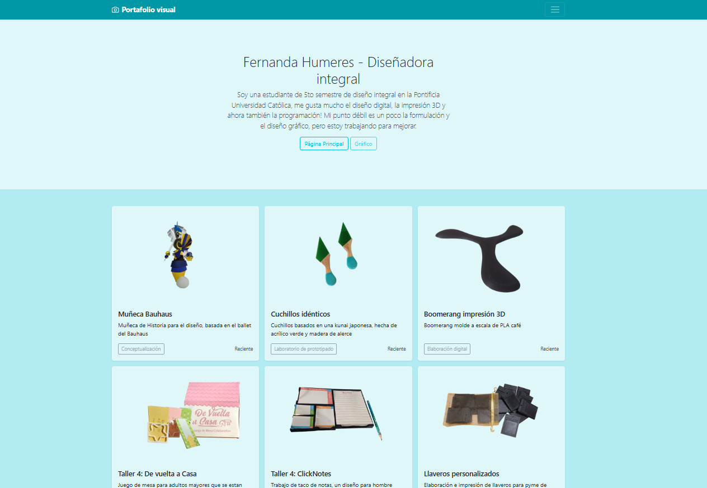
**Tipo:** Portafolio estudiantil (Fernanda Humeres)

 **Aspectos positivos:**
- Honesto y directo sobre fortalezas y debilidades
- Lenguaje personal y cercano
- Simple y funcional para un primer acercamiento

**Aspectos negativos:**
- Muy básico visualmente (HTML sin estilizar)
- No muestra proyectos ni trabajos concretos
- Falta identidad visual propia
- Sin navegación ni secciones adicionales

---

### 5. [Portafolio Profesor FACO](https://faco.cl/etcetera)
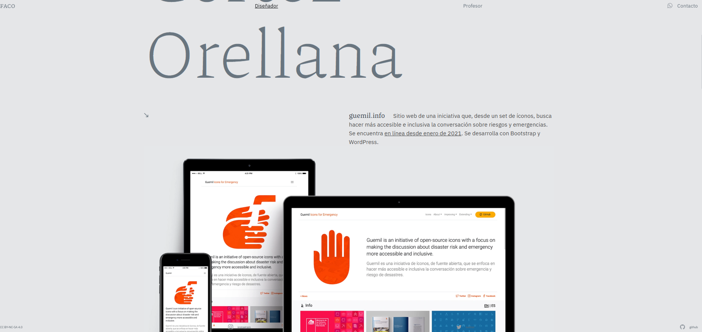
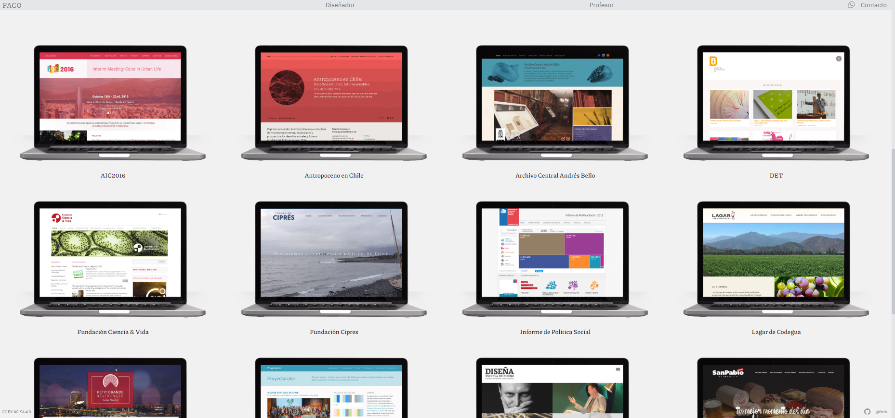
**Tipo:** Portafolio personal con enfoque archivístico

 **Aspectos positivos:**
- Contexto histórico claro
- Link a Tumblr del estudio (amplía contenido)
- Minimalista y directo al grano
- Alusivo con detalles como usar "computadoras" como marco de foto

  **Aspectos negativos:**
- Poca información sobre cada proyecto

---

### 6. [ALT Agency](https://www.altagency.co.uk)
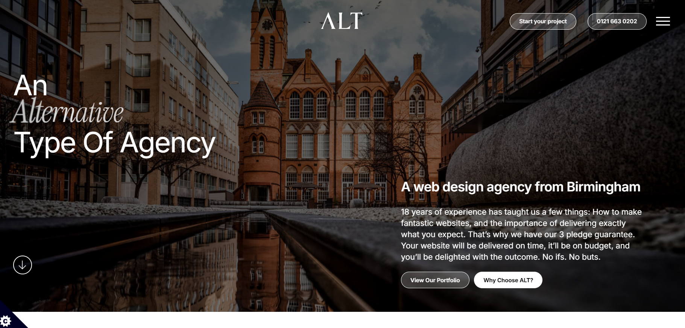

**Tipo:** Agencia de diseño web en Birmingham, UK

 **Aspectos positivos:**
- Profesional pero cercano
- Promesa de mantención continua

  **Aspectos negativos:**
- Diseño conservador, poco memorable visualmente
- Demasiado texto corporativo sin visuales
- No diferencia claramente sus servicios

---

### 7. [Lincs Group](https://lincsgroup.uk)
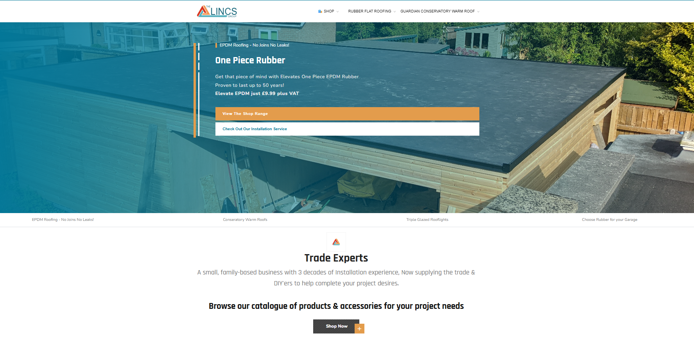
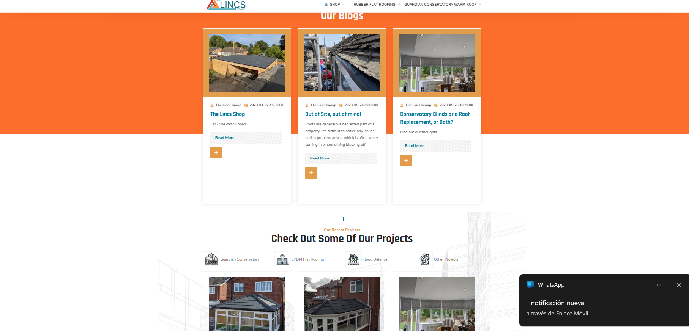
**Tipo:** Grupo de diseño y desarrollo web en Lincolnshire, UK

 **Aspectos positivos:**
- Servicios variados (web, hosting, software)
- Estética limpia

  **Aspectos negativos:**
- Sin información sobre portafolio o casos
- Estética demasiado profesional, poco cercana
- Bastante "estándar", falta de presencia de marca

##  Referentes de Diseño

### 1. [Riot Games](https://www.riotgames.com/es)
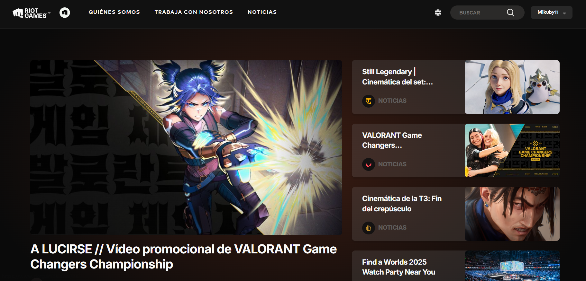
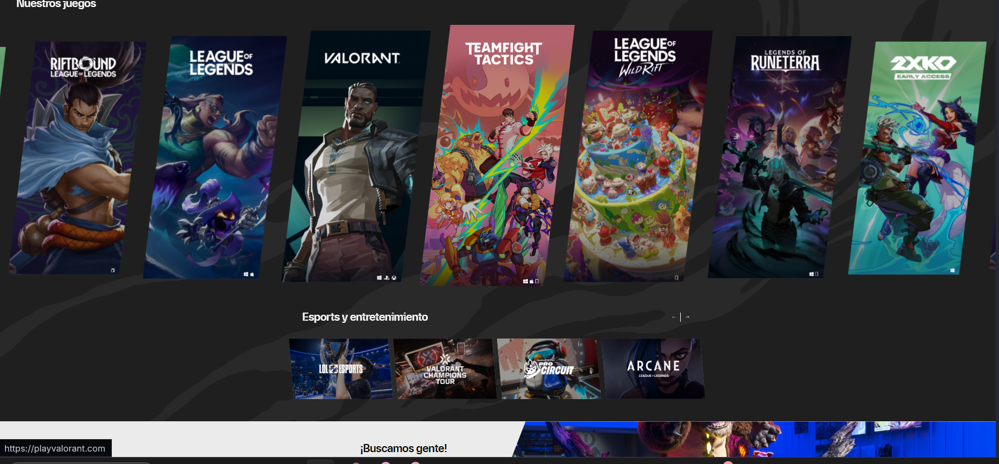
**Tipo:** Hub corporativo de desarrolladora de videojuegos

 **Aspectos positivos:**
- **Diseño modular de alto impacto**: Cards grandes con imágenes cinematográficas de calidad AAA
- **Jerarquía visual potente**: Imágenes hero full-screen que capturan atención inmediata
- **Navegación clara** y estructura bien definida
- **Animaciones sutiles pero efectivas**: Transiciones suaves, hover effects, parallax en scroll
- **Tipografía bold y legible**: Fuentes sans-serif modernas con pesos variables
- **Responsive impecable**: Se adapta perfectamente a móvil sin perder impacto visual
- **Storytelling visual**: Cada sección cuenta una historia con imágenes y videos cinematográficos

  **Aspectos negativos:**
- Peso de carga alto (imágenes 3840x1600px requieren buena conexión)
- Saturación visual puede resultar abrumadora
- Difícil de replicar sin recursos de alta calidad

---

### 2. [League of Legends](https://www.leagueoflegends.com/es-es)
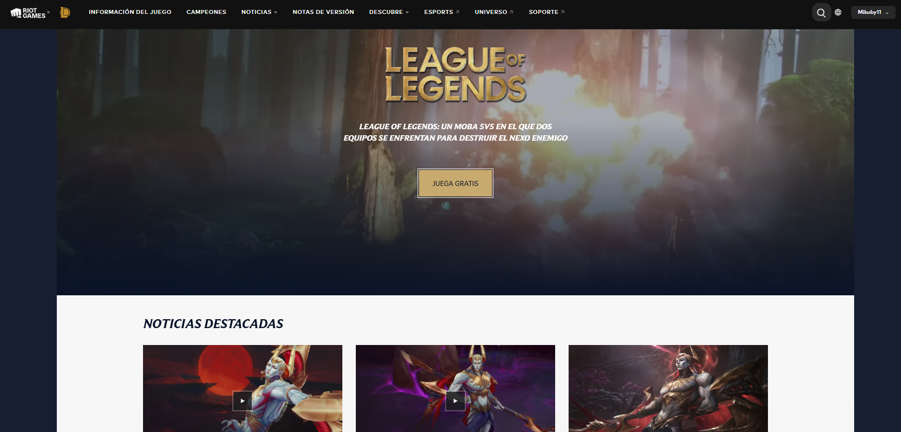
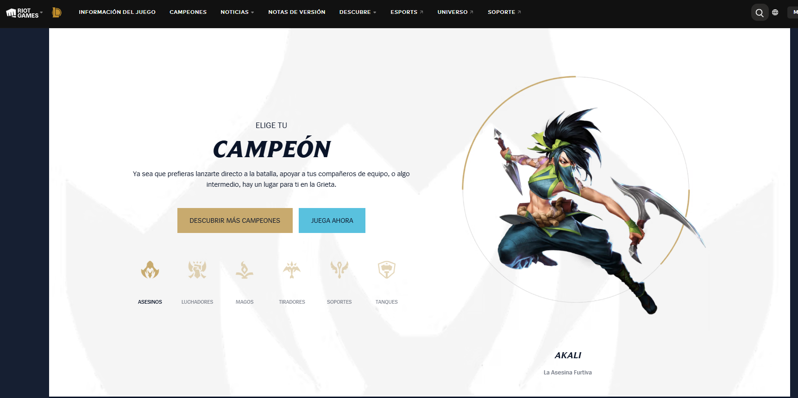
**Tipo:** Landing page de videojuego + portal de noticias

 **Aspectos positivos:**
- **Categorización visual clara**: Organización por roles con iconografía distintiva
- **Gradientes vibrantes y neón**: Paleta de colores fantasía épica (púrpuras, azules eléctricos, dorados)
- **Micro-interacciones**: Hover effects en cards, transiciones smooth, elementos reactivos al cursor
- **Diseño de cards premium**: Cada noticia/actualización con tratamiento gráfico de alta calidad
- **Estética coherente** con el universo del juego

 **Aspectos negativos:**
- Curva de aprendizaje visual alta
- Difícil escalabilidad para proyectos pequeños
- Puede resultar caótico con múltiples secciones compitiendo por atención
- Poco minimalista, sin "respiro" visual
- Requiere actualización constante
- Menos responsive que RiotGames

## Moodboard

<!-- Inserta aquí las imágenes de tu moodboard -->
<!-- Ejemplo: -->
<!--  -->
<!--  -->

> **Nota:** Paleta de colores y referencias sensoriales en evaluación

## Próximos Pasos

- [ ] Utilizar plantilla Bootstrap como base: [Bootstrap Product Example](https://getbootstrap.com/docs/5.3/examples/product/#)
- [ ] Organizar páginas principales e interinas con sus objetivos y funciones
- [ ] Crear organigrama de navegación
- [ ] Definir paleta de colores final
---

**Última actualización:** [Fe
